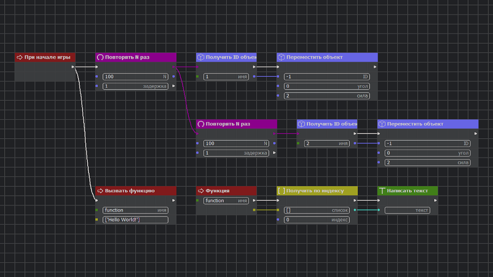
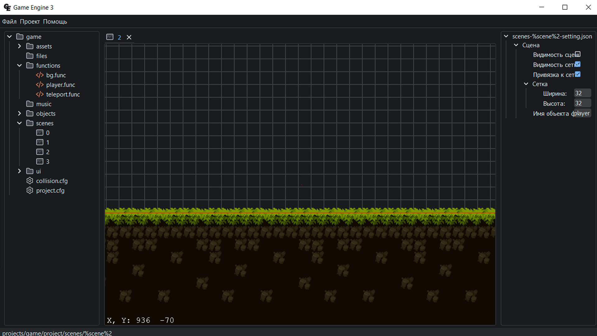
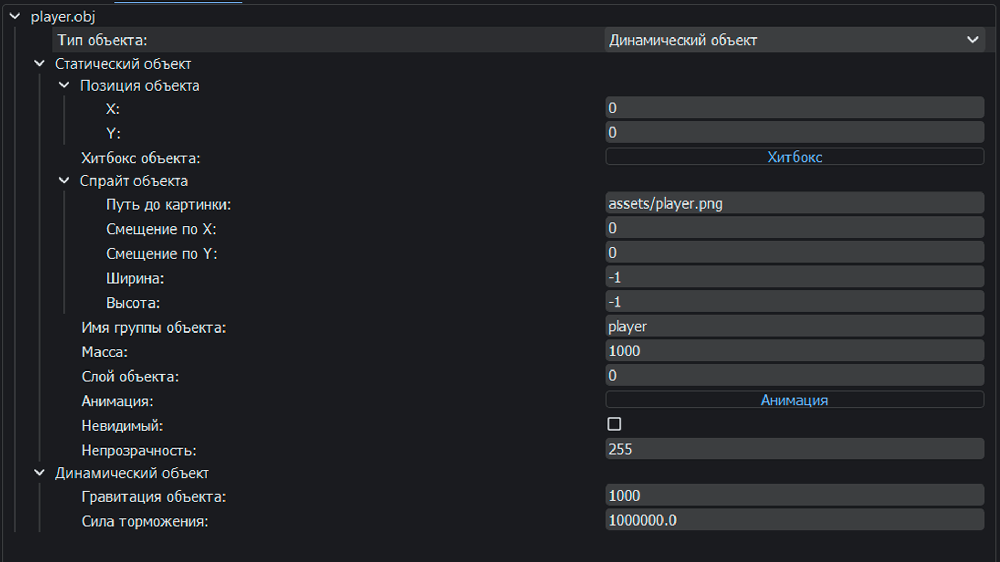
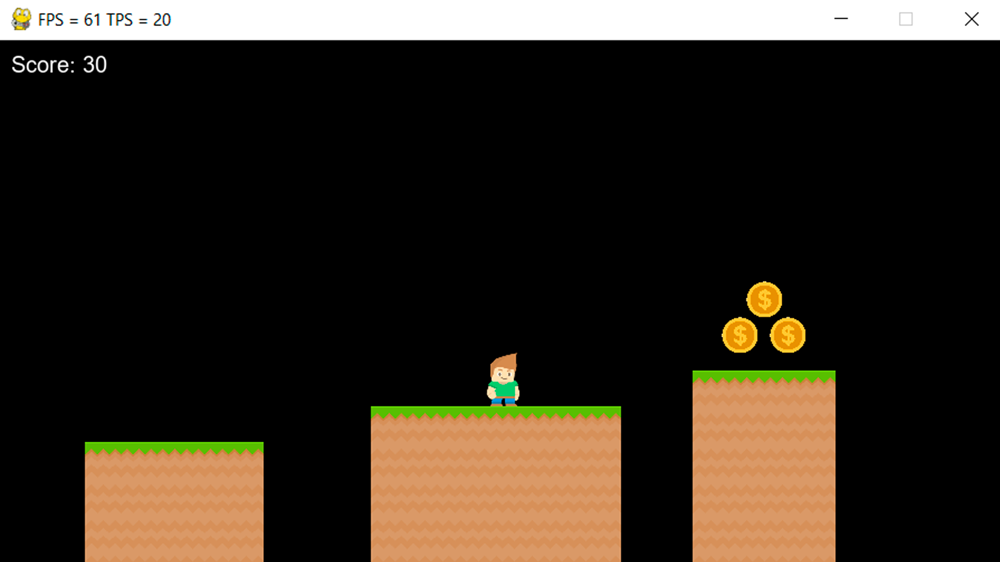

# Game Engine LAB

**Game Engine LAB** is a powerful software framework for creating 2D games and applications with intuitive visual programming. The engine provides a user-friendly node-based editor that allows game creation without writing textual code.

<table>
  <tr>
    <td></td>
    <td></td>
  </tr>
  <tr>
    <td></td>
    <td></td>
  </tr>
</table>

[ [English](README.md) | [Русский](descriptions/ru.md) ]

## Key Features

- **Visual Programming** - Create game logic using a node system
- **Built-in Physics** - Full-fledged physics engine with collisions and object interactions
- **Animation System** - Flexible animation setup with sprite grouping
- **Graphical Rendering** - Work with sprites and textures
- **Cross-Platform Support** - Windows and Linux
- **Open Source** - Fully open-source project

## Installation

1. Visit the [official website](https://artyom7777.pythonanywhere.com/) or [GitHub repository](https://github.com/artyom7774/Game-Engine-3/releases/)
2. Download the program installer
3. Launch **Game Engine LAB.exe**

## System Requirements

- **Windows 10-11**
- **4GB RAM**
- **Intel Core i3-12100 / AMD Ryzen 5 4500**
- **GTX 1650 / AMD Radeon RX 6500 XT**

## Quick Start

### Creating Your First Project

1. Launch Game Engine LAB
2. In the **File** menu, select **Create Project** or **Create from Template**
3. Configure basic project parameters in the **project.cfg** file:
   - Window size
   - Title and icon
   - Maximum FPS and TPS values
   - Fullscreen mode
   - Initial scene

### Core Components

#### Objects

- **Static Object** - Immovable objects (walls)
- **Dynamic Object** - Physics-enabled objects (player, enemies, entities)
- **Kinematic Object** - Physics-enabled objects (platforms)
- **Particle** - Particle (for creating effects)
- **Text** - Object for displaying text
- **Button** - Object with a field, text, and click event handling

#### Customizable Parameters

- Position
- Sprite
- Hitbox
- Group
- Mass
- Layer
- Animation
- Invsible
- Opacity

#### Scenes

- Object placement in the game world
- Camera setup
- Interaction configuration

#### Functions (Node-Based Editor)

Editor based on connecting functional nodes
<br>
Over 80 available nodes divided into 10 categories:
- Events
- Loops
- Text
- Number
- Logic
- Objects
- Animation
- Another
- Set
- Music

#### Collision Configuration

In the **collision.cfg** file, configure interactions between different object groups by defining which objects can collide with each other.

#### Animation System

- Create animation groups
- Configure sprites for each group
- Animation parameters:
  - Loop animation
  - Playback speed
  - Autoplay on scene load

### Compilation and Execution

- Quick project launch with debug mode
- Compile project into an executable (.exe) file
- Save project or its compiled version

## Project Architecture

```
Game Engine LAB
├─ Engine
│   ├─ Sprite rendering (Pygame)
│   ├─ Sprite and texture handling (Pillow)
│   ├─ Physics engine
│   ├─ Collision system
│   └─ Animation system
│
├─ Editor interface
│   ├─ AI assistant
│   ├─ Object editor
│   ├─ Scene editor
│   ├─ Node editor
│   └─ Project execution and compilation
│
├─ Website
│   ├─ Project documentation
│   └─ Node list with examples
│
└─ GELauncher
    └─ Launcher for using Game Engine LAB
```

## Technical Details

- **Primary Language**: Python
- **Optimization**: Cython for performance enhancement
- **Graphics**: Pygame for rendering
- **Images**: Pillow for sprite and texture processing
- **Physics**: Custom physics engine

## Project Examples

Examples available in a [dedicated repository](https://github.com/artyom7774/Game-Engine-3-projects):
- Dinosaur Runner
- Snake Game
- Platformer with Map Generation

## Development Roadmap

- Shader support
- Mobile platform export (iOS, Android) and web version
- Built-in sprite editor
- Node library expansion
- New programming features

## Community and Support

- 🌐 [Official Website](https://artyom7777.pythonanywhere.com/)
- 📚 [Documentation & Guides](https://artyom7777.pythonanywhere.com/documentation/)
- 💬 [Discord Community](https://discord.gg/AgYqzHYUVf)
- 📝 [GitHub Repository](https://github.com/artyom7774/Game-Engine-3)

## Contributing

Game Engine LAB is an open-source project. We welcome community contributions:
- Bug reports
- Feature suggestions
- Code and fixes
- Documentation and examples

## License

Distributed under an open-source license. See LICENSE file for details.

---

**Game Engine LAB** is not just a tool, but a complete ecosystem for rapid 2D game development. Try the engine in action and discover new possibilities for programming without writing code!
